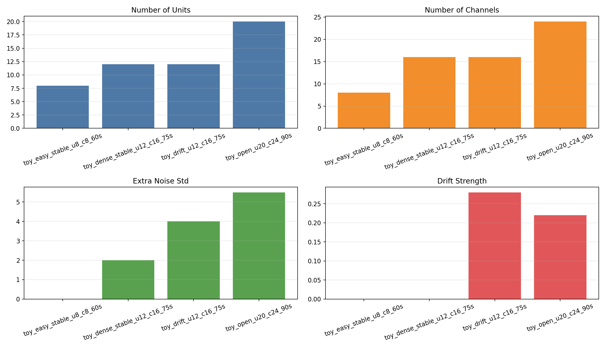
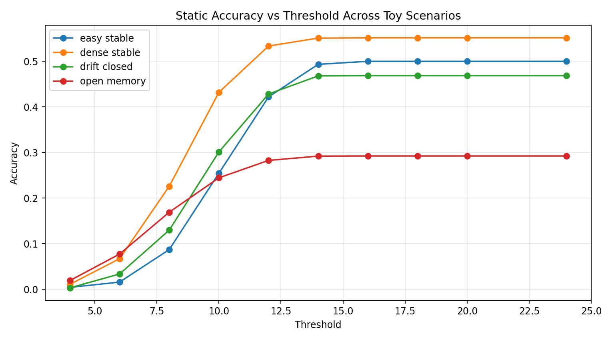
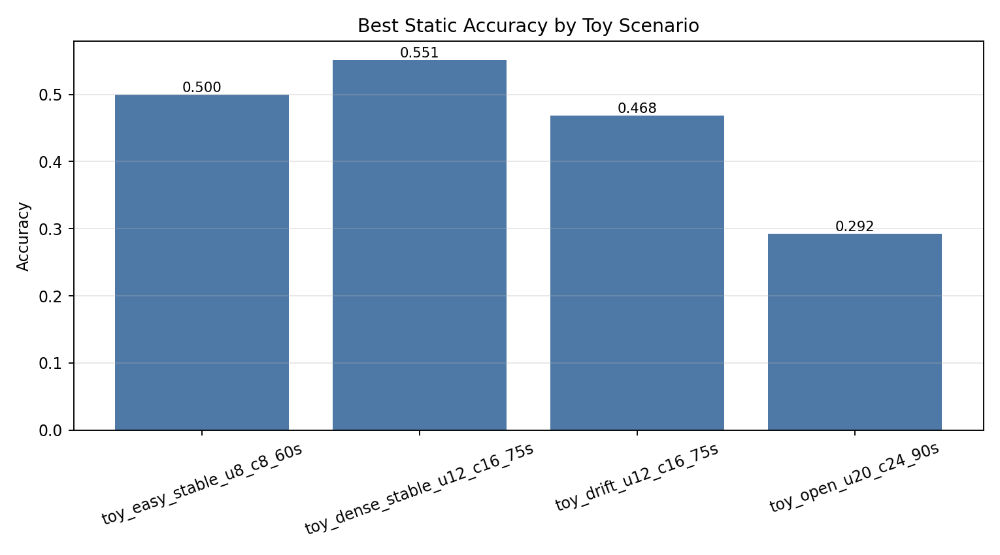
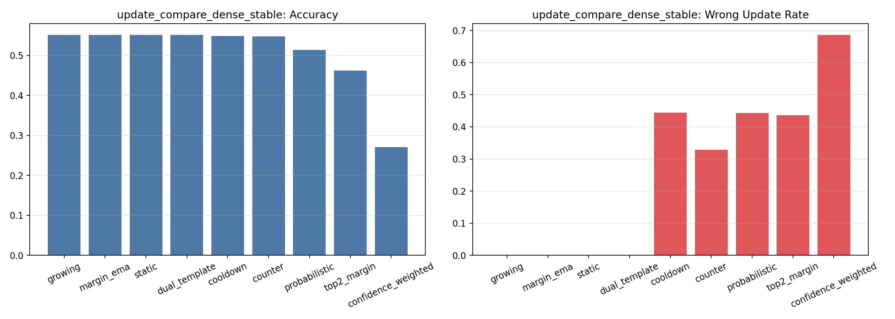
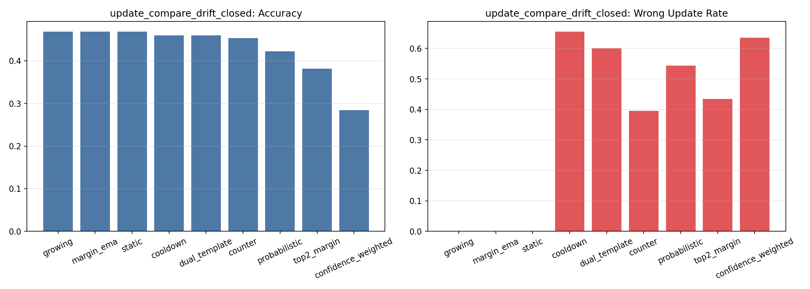
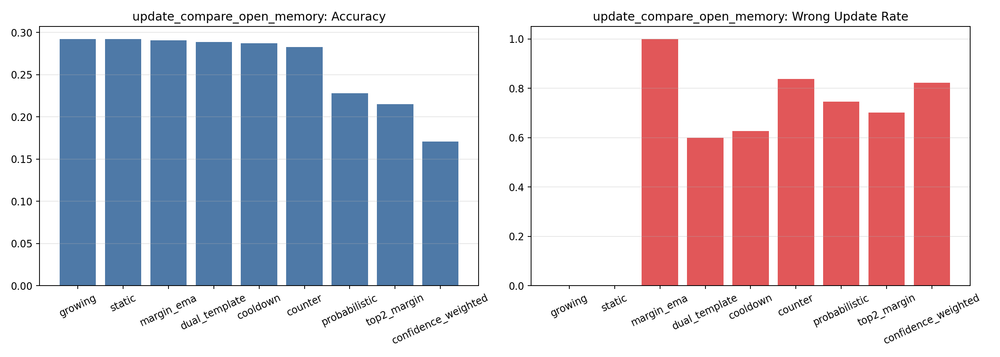

# Toy Spike CAM 全面实验报告

## 1. 实验目标

这轮实验专门为毕设服务，目的不是追求真实数据上的最终绝对性能，而是先在**可控 toy 数据**上系统研究：

- 在什么样的数据条件下，dynamic update 值得用？
- 在什么样的数据条件下，static template 反而更稳？
- bit 宽度、初始化方法、encoder 变化后，这些结论会不会改变？

之所以这样设计，是因为真实数据目前 separability 偏弱，直接在真实数据上比较所有动态更新算法，会把“前端特征不够好”和“更新策略本身好不好”混在一起。

## 2. Toy 数据集设计

本轮一共生成了 4 个 toy dataset，全部都保存成和真实数据一致的 `.npz` raw-data 格式，然后复用同一条 Spike CAM pipeline。

| Scenario | Units | Channels | Noise | Drift | Best Static Accuracy |
| --- | ---: | ---: | ---: | ---: | ---: |
| toy_easy_stable_u8_c8_60s | 8 | 8 | 0.0000 | 0.0000 | 0.5000 |
| toy_dense_stable_u12_c16_75s | 12 | 16 | 2.0000 | 0.0000 | 0.5514 |
| toy_drift_u12_c16_75s | 12 | 16 | 4.0000 | 0.2800 | 0.4685 |
| toy_open_u20_c24_90s | 20 | 24 | 5.5000 | 0.2200 | 0.2923 |

设计动机：

- `toy_easy_stable_u8_c8_60s`：最接近 previous work 的 sanity check，验证整条 pipeline 在简单条件下能得到明显高于随机的结果。
- `toy_dense_stable_u12_c16_75s`：增加 unit 数和 channel 数，但不加 drift，用来观察“仅仅问题变密集”时 update 有没有必要。
- `toy_drift_u12_c16_75s`：在 dense stable 的基础上加入 channel-wise drift 和额外噪声，用来观察 dynamic update 是否真的有帮助。
- `toy_open_u20_c24_90s`：增加 unit 数并采用 `stream > memory` 的 open-set protocol，用来研究 memory-limited CAM 的真实目标场景。

共享 pipeline 设置：

- preprocess: `bandpass 300-6000 + global median CMR`
- waveform: `45 samples`, `align_mode=none`
- channel selection: `all channels`
- flatten: `time_major`
- 主评估协议：`chronological online evaluation`, `warmup_ratio=0.5`
- 主 encoder：`PCA 32-bit`，`binarize_mode=zero`，用于最大程度贴近 previous work

## 3. Stage A: 协议 sanity check

先在最简单的 `easy stable` 数据上比较 `random split` 和 `chronological split`，确认 toy pipeline 本身没有坏掉。

| Variant | Acc | Macro-F1 | BalAcc | Reject | FalseAccept | AcceptedAcc | Updates | WrongUpdRate |
| --- | --- | --- | --- | --- | --- | --- | --- | --- |
| random_static | 0.5100 | 0.4942 | 0.5057 | 0.0008 | 0.0000 | 0.5104 | 0 | 0.0000 |
| chronological_static | 0.5000 | 0.4912 | 0.4972 | 0.0000 | 0.0000 | 0.5000 | 0 | 0.0000 |

结论：在 toy easy 场景下，chronological 评估本身并不会把结果压到很低，说明当前 pipeline 在简单数据上是能正常识别的。

## 4. Stage B: 数据难度对 static baseline 的影响

先固定 encoder 和 static CAM，只看不同 toy 场景本身有多难。这一步的目的，是把“数据难度”与“动态更新效果”分开。

| Scenario | Units | Channels | Noise | Drift | Best Static Accuracy |
| --- | ---: | ---: | ---: | ---: | ---: |
| toy_easy_stable_u8_c8_60s | 8 | 8 | 0.0000 | 0.0000 | 0.5000 |
| toy_dense_stable_u12_c16_75s | 12 | 16 | 2.0000 | 0.0000 | 0.5514 |
| toy_drift_u12_c16_75s | 12 | 16 | 4.0000 | 0.2800 | 0.4685 |
| toy_open_u20_c24_90s | 20 | 24 | 5.5000 | 0.2200 | 0.2923 |

结论：随着 unit 数、channel 数、噪声和 drift 增加，最优 static accuracy 会逐步下降；而 open-set memory-limited 场景下降最明显。这说明后面所有 dynamic update 的比较，必须结合数据场景来解读。

相关图：

## 5. Stage C: Dynamic update strategy 对比

这部分是整轮 toy study 的主实验。我们在 3 种代表性场景下比较所有 update strategy：

1. `dense stable`：问题更密集，但没有 drift
2. `drift closed`：有 drift，但仍是 closed-set
3. `open memory`：既有 drift，又有 memory 外类需要 reject

### 5.1 Dense stable：没有 drift 时，update 是否还有必要？

| Variant | Acc | Macro-F1 | BalAcc | Reject | FalseAccept | AcceptedAcc | Updates | WrongUpdRate |
| --- | --- | --- | --- | --- | --- | --- | --- | --- |
| growing | 0.5514 | 0.5479 | 0.5475 | 0.0000 | 0.0000 | 0.5514 | 0 | 0.0000 |
| margin_ema | 0.5514 | 0.5479 | 0.5475 | 0.0000 | 0.0000 | 0.5514 | 0 | 0.0000 |
| static | 0.5514 | 0.5479 | 0.5475 | 0.0000 | 0.0000 | 0.5514 | 0 | 0.0000 |
| dual_template | 0.5510 | 0.5471 | 0.5470 | 0.0000 | 0.0000 | 0.5510 | 1 | 0.0000 |
| cooldown | 0.5488 | 0.5455 | 0.5450 | 0.0000 | 0.0000 | 0.5488 | 18 | 0.4444 |
| counter | 0.5470 | 0.5412 | 0.5440 | 0.0000 | 0.0000 | 0.5470 | 67 | 0.3284 |
| probabilistic | 0.5139 | 0.5083 | 0.5096 | 0.0000 | 0.0000 | 0.5139 | 621 | 0.4428 |
| top2_margin | 0.4621 | 0.5009 | 0.4597 | 0.1790 | 0.0000 | 0.5629 | 436 | 0.4358 |
| confidence_weighted | 0.2705 | 0.2683 | 0.2718 | 0.0000 | 0.0000 | 0.2705 | 255 | 0.6863 |

结论：在 dense stable 条件下，最佳实际 dynamic 是 `dual_template`，accuracy=0.5510。如果它只比 static 好一点，说明在没有明显 drift 的条件下，dynamic update 的必要性并不强。

### 5.2 Drift closed：出现 drift 后，dynamic update 是否开始有价值？

| Variant | Acc | Macro-F1 | BalAcc | Reject | FalseAccept | AcceptedAcc | Updates | WrongUpdRate |
| --- | --- | --- | --- | --- | --- | --- | --- | --- |
| growing | 0.4685 | 0.4687 | 0.4671 | 0.0000 | 0.0000 | 0.4685 | 0 | 0.0000 |
| margin_ema | 0.4685 | 0.4687 | 0.4671 | 0.0000 | 0.0000 | 0.4685 | 0 | 0.0000 |
| static | 0.4685 | 0.4687 | 0.4671 | 0.0000 | 0.0000 | 0.4685 | 0 | 0.0000 |
| cooldown | 0.4596 | 0.4587 | 0.4582 | 0.0000 | 0.0000 | 0.4596 | 29 | 0.6552 |
| dual_template | 0.4596 | 0.4602 | 0.4582 | 0.0000 | 0.0000 | 0.4596 | 5 | 0.6000 |
| counter | 0.4535 | 0.4513 | 0.4518 | 0.0000 | 0.0000 | 0.4535 | 76 | 0.3947 |
| probabilistic | 0.4221 | 0.4288 | 0.4207 | 0.0000 | 0.0000 | 0.4221 | 677 | 0.5436 |
| top2_margin | 0.3811 | 0.4247 | 0.3809 | 0.2250 | 0.0000 | 0.4917 | 362 | 0.4337 |
| confidence_weighted | 0.2845 | 0.2942 | 0.2832 | 0.0000 | 0.0000 | 0.2845 | 200 | 0.6350 |

结论：在 drift closed 条件下，最佳实际 dynamic 是 `counter`，accuracy=0.4535，wrong_update_rate=0.3947。这一组最能反映“update 的收益是否值得它的代价”。

### 5.3 Open memory：unknown pressure 下，dynamic update 会不会反而更危险？

| Variant | Acc | Macro-F1 | BalAcc | Reject | FalseAccept | AcceptedAcc | Updates | WrongUpdRate |
| --- | --- | --- | --- | --- | --- | --- | --- | --- |
| growing | 0.2923 | 0.1895 | 0.2799 | 0.0004 | 0.4779 | 0.2924 | 0 | 0.0000 |
| static | 0.2923 | 0.1895 | 0.2799 | 0.0004 | 0.4779 | 0.2924 | 0 | 0.0000 |
| margin_ema | 0.2906 | 0.1885 | 0.2781 | 0.0004 | 0.4779 | 0.2907 | 5 | 1.0000 |
| dual_template | 0.2886 | 0.1879 | 0.2764 | 0.0000 | 0.4783 | 0.2886 | 5 | 0.6000 |
| cooldown | 0.2873 | 0.1881 | 0.2753 | 0.0002 | 0.4781 | 0.2873 | 91 | 0.6264 |
| counter | 0.2826 | 0.1853 | 0.2708 | 0.0000 | 0.4783 | 0.2826 | 62 | 0.8387 |
| probabilistic | 0.2280 | 0.1502 | 0.2193 | 0.0000 | 0.4783 | 0.2280 | 1229 | 0.7453 |
| top2_margin | 0.2153 | 0.1593 | 0.2065 | 0.2098 | 0.3740 | 0.2724 | 923 | 0.7021 |
| confidence_weighted | 0.1708 | 0.1021 | 0.1621 | 0.0002 | 0.4783 | 0.1708 | 198 | 0.8232 |

结论：在 open memory 条件下，最佳实际 dynamic 是 `dual_template`，accuracy=0.2886，false_accept_rate=0.4783。如果 false accept 很高，就说明 open-set 条件下 dynamic update 容易被 unknown spike 污染。

相关图：

## 6. Stage D: Bit budget 消融（drift 场景）

选择 drift 场景做 bit 消融，是因为它最能体现“表示能力不足”和“动态更新是否能补救”之间的关系。

| Variant | Acc | Macro-F1 | BalAcc | Reject | FalseAccept | AcceptedAcc | Updates | WrongUpdRate |
| --- | --- | --- | --- | --- | --- | --- | --- | --- |
| bits8_counter | 0.6930 | 0.6752 | 0.6973 | 0.0000 | 0.0000 | 0.6930 | 12 | 0.0000 |
| bits8_static | 0.6903 | 0.6710 | 0.6947 | 0.0000 | 0.0000 | 0.6903 | 0 | 0.0000 |
| bits16_static | 0.5249 | 0.5181 | 0.5252 | 0.0000 | 0.0000 | 0.5249 | 0 | 0.0000 |
| bits16_counter | 0.4910 | 0.4886 | 0.4908 | 0.0000 | 0.0000 | 0.4910 | 20 | 0.2500 |
| bits32_static | 0.4685 | 0.4687 | 0.4671 | 0.0000 | 0.0000 | 0.4685 | 0 | 0.0000 |
| bits32_counter | 0.4535 | 0.4513 | 0.4518 | 0.0000 | 0.0000 | 0.4535 | 76 | 0.3947 |
| bits64_static | 0.3538 | 0.3485 | 0.3524 | 0.0000 | 0.0000 | 0.3538 | 0 | 0.0000 |
| bits64_counter | 0.3304 | 0.3279 | 0.3291 | 0.0000 | 0.0000 | 0.3304 | 296 | 0.6351 |

设计说明：bit 宽度使用 `8/16/32/64`，阈值不是随便手填，而是按 drift 场景中 `32-bit` 最优阈值的比例缩放得到。这样不同 bit 宽度的比较更公平。

结论：bit 越多并不总是越好。你后面写论文时，可以把这一节写成“bit budget 改变了 static / dynamic 的工作点，而不是单纯提升一个数字”。

## 7. Stage E: 初始化策略消融（drift 场景）

初始化策略在真实论文里通常不是主角，但它会影响 online 阶段的起点，所以还是值得单独测。

| Variant | Acc | Macro-F1 | BalAcc | Reject | FalseAccept | AcceptedAcc | Updates | WrongUpdRate |
| --- | --- | --- | --- | --- | --- | --- | --- | --- |
| stable_mask_counter | 0.7556 | 0.7264 | 0.7577 | 0.0000 | 0.0000 | 0.7556 | 1153 | 0.2619 |
| stable_mask_static | 0.7556 | 0.7264 | 0.7577 | 0.0000 | 0.0000 | 0.7556 | 0 | 0.0000 |
| majority_vote_static | 0.4685 | 0.4687 | 0.4671 | 0.0000 | 0.0000 | 0.4685 | 0 | 0.0000 |
| majority_vote_counter | 0.4535 | 0.4513 | 0.4518 | 0.0000 | 0.0000 | 0.4535 | 76 | 0.3947 |
| medoid_counter | 0.4155 | 0.4178 | 0.4143 | 0.0000 | 0.0000 | 0.4155 | 77 | 0.5065 |
| medoid_static | 0.4124 | 0.4154 | 0.4115 | 0.0000 | 0.0000 | 0.4124 | 0 | 0.0000 |

结论：初始化方法会影响结果，但通常不如数据难度、threshold 和 update 风险来得主导。你可以把它作为支持性消融，而不是主结论。

## 8. Stage F: Encoder 对比（drift 场景）

为了不让整个 toy study 只停留在 PCA 上，我们在 drift 场景下补了 encoder 对比：

- `PCA 32-bit`
- `external normal AE 16-bit`
- `external shallow AE 16-bit`

并且每个 external AE 都先单独训练 artifact，再固定前端，只比较 CAM 侧。

| Variant | Acc | Macro-F1 | BalAcc | Reject | FalseAccept | AcceptedAcc | Updates | WrongUpdRate |
| --- | --- | --- | --- | --- | --- | --- | --- | --- |
| pca32_static | 0.4685 | 0.4687 | 0.4671 | 0.0000 | 0.0000 | 0.4685 | 0 | 0.0000 |
| pca32_counter | 0.4535 | 0.4513 | 0.4518 | 0.0000 | 0.0000 | 0.4535 | 76 | 0.3947 |
| ae16_normal_counter | 0.1782 | 0.0509 | 0.1634 | 0.0000 | 0.0000 | 0.1782 | 0 | 0.0000 |
| ae16_normal_static | 0.1782 | 0.0509 | 0.1634 | 0.0000 | 0.0000 | 0.1782 | 0 | 0.0000 |
| ae16_shallow_counter | 0.1773 | 0.0502 | 0.1626 | 0.0000 | 0.0000 | 0.1773 | 0 | 0.0000 |
| ae16_shallow_static | 0.1773 | 0.0502 | 0.1626 | 0.0000 | 0.0000 | 0.1773 | 0 | 0.0000 |

结论：这一节主要回答“CAM 侧结论是否依赖某一个 encoder”。如果不同 encoder 下，dynamic / static 的排序趋势大体一致，那你的 CAM 结论就更扎实。

## 9. 最重要的研究结论

- 在简单 toy stable 数据上，当前 Spike CAM pipeline 完全可以得到远高于随机的结果，这说明系统本身不是坏掉了。
- 随着 unit 数、channel 数、噪声和 drift 增加，static baseline 会系统性下降，这一步明确了“数据难度”本身就是一阶因素。
- 在没有 drift 的稳定场景下，dynamic update 通常不一定有明显必要，甚至可能只是引入额外风险。
- 在 drift 场景下，dynamic update 才真正有讨论价值；但是否值得用，要看 accuracy 提升能不能覆盖 wrong update 的代价。
- 在 memory-limited open-set 场景下，`false_accept` 比 raw accuracy 更关键。dynamic update 如果让 unknown spike 更容易被接受，就会快速污染模板。
- bit 宽度的收益不是单调的，应该被表述成“表示能力与匹配风险之间的 trade-off”。
- 初始化方法有影响，但影响通常弱于数据难度、threshold 和 dynamic update 机制本身。
- toy study 的真正价值，不是替代真实数据，而是提供一个**受控环境**，先把 CAM 端的规律看清楚。

## 10. 这轮 toy study 对毕设写作有什么帮助

你可以把它写成这样：

1. 先在 toy 数据上说明方法机制：在可控难度条件下比较 dynamic update。
2. 再说明从 stable -> drift -> open memory 的难度递进。
3. 用 toy 结果总结：哪些 update 在什么条件下有价值，哪些条件下会引入污染风险。
4. 最后再回到真实数据，说明为什么真实数据结果会更低，以及 toy study 给了你什么解释框架。

## 11. 建议的默认 toy 主配置

- 推荐主 toy 数据集：`toy_drift_u12_c16_75s`
- 推荐主 encoder：`PCA 32-bit` 作为机制研究主线；AE 作为补充对比
- 推荐主 updater：`counter` 与 `static` 共同作为主对照
- 推荐 memory-limited toy 数据集：`toy_open_u20_c24_90s`

## 12. 下一步建议

- 如果你想继续把 toy study 做得更像论文，可以再加一个“drift strength sweep”，直接研究 update 何时开始值得用。
- 如果你想把真实数据也写进去，可以把 toy 结果作为“机制结论”，再把真实数据结果作为“实际挑战与限制”。
- 如果后面你希望，我可以继续把这份报告直接改写成你毕设实验章节的中文初稿。

